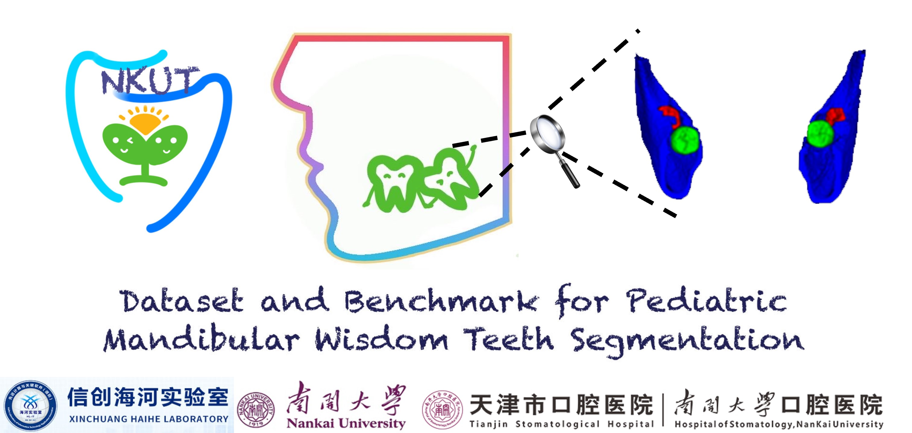

# NKUT: Dataset and Benchmark for Pediatric Mandibular Wisdom Teeth Segmentation

## News
* `March. 23th, 2024`: Our paper was accepted by IEEE Journal of Biomedical and Health Informatics (JBHI), congratulations!🎉🎉🎉🎉 
* `April. 8th, 2024`: We released the NKUT dataset. Now, researchers can apply to obtain the dataset.🎉🎉🎉🎉 
* `May. 15th, 2024`: We released the 2D WTNet model. 🎉🎉🎉🎉 

## To Do List
- [X] NKUT Dataset release
- [X] WTNet 2D model code release
- [ ] WTNet 3D model code release
- [ ] Training code release

## Request for NKUT Dataset
### If you wish to use the NKUT dataset in your own research, you need to complete the following steps:
* 1. Download and fill in the `Application.pdf` PDF file in the repository. Please note that all items in the file need to be filled in completely and cannot be left blank, otherwise it may affect the acquisition of the dataset.
* 2. Send an email to `bdor25@163.com`. The subject of the email should be "NKUT Dataset Request" and briefly describe your name, contact information and institution or organization in the content of the email. Remember to upload the PDF completed in last step as an attachment of your email.
* 3. We will review your application and notify you via email whether your application has been approved or if further submission of materials is required within two weeks. Please arrange your time reasonably.
* 4. For researchers who pass the application, we will attach a link to obtain the dataset with the email. You will get about 30 cases of NKUT dataset and their corresponding pixel-level expert annotations, a doc file recording the details of each data will also be included.
  
## Model
### WTNet_2D Model

## Training
coming soon

## Citation
If you used NKUT in your own research, please give us a star and cite our paper below:

    @ARTICLE{10485282,
      author={Zhou, Zhenhuan and Chen, Yuzhu and He, Along and Que, Xitao and Wang, Kai and Yao, Rui and Li, Tao},
      journal={IEEE Journal of Biomedical and Health Informatics}, 
      title={NKUT: Dataset and Benchmark for Pediatric Mandibular Wisdom Teeth Segmentation}, 
      year={2024},
      volume={},
      number={},
      pages={1-11},
      keywords={Teeth;Dentistry;Image segmentation;Task analysis;Bones;Annotations;Three-dimensional displays;CBCT dataset;pediatric wisdom teeth segmentation;pediatric germectomy;multi-scale feature fusion},
      doi={10.1109/JBHI.2024.3383222}}
      
## Acknowledgment
Code can only be used for ACADEMIC PURPOSES. NO COMERCIAL USE is allowed. Copyright © College of Computer Science, Nankai University. All rights reserved.

      
